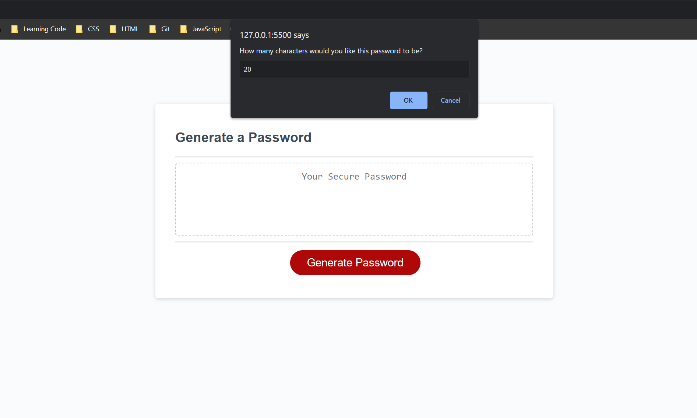

# password-generator 
A repository to hold the source code to  password generator application. My deployed application may be viewed through the section titled ## Deployed application link. 

## Motivation
This project exists to showcase my ability to utilize JavaScript to randomly generate a password that meets certain criterias.

## Screenshots

Below are screenshot examples of the application, and it's functionality:

## Tech/framework used
JavaScript, HTML, and CSS

## Deployed application link

Deplyed application: https://nicanthoni.github.io/project-password-generator/

## How to use?
Open the deployed application or refresh the page to begin. Click the 'Generate Password' button. Then, following the prompt, input a number equivalent to how many characters you'd like the password to be. From there, select 'ok' to confirm use of those types of characters or 'cancel' to indicate no use of those types of characters. Your password will be generated in the center of the white box, where it can be copied from. To restart process, either repeate the above process or refresh the page. 

## License

MIT © [nicanthoni]()